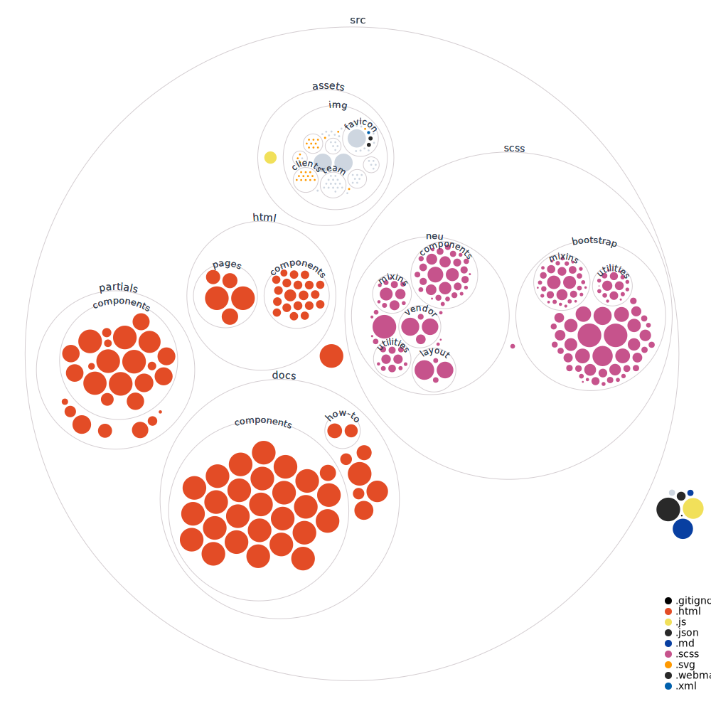

# [Neu UI - DEMO](https://neu-ui.surge.sh)

[![Uptime][uptime-shield]][uptime-url]
[![Contributors][contributors-shield]][contributors-url]
[![Forks][forks-shield]][forks-url]
[![Stargazers][stars-shield]][stars-url]
[![Issues][issues-shield]][issues-url]
[![repo-size][repo-size-shield]][repo-size-url]
[![license][license-shield]][license-url]

[observatory-shield]: https://img.shields.io/mozilla-observatory/grade-score/neu-ui.surge.sh?publish&style=for-the-badge
[uptime-shield]: https://img.shields.io/uptimerobot/ratio/m792598928-d0239381be648275cbe18311?style=for-the-badge
[uptime-url]: https://neu-ui.surge.sh
[contributors-shield]: https://img.shields.io/github/contributors/hirako2000/neu-ui.svg?style=for-the-badge
[contributors-url]: https://github.com/hirako2000/neu-ui/graphs/contributors
[forks-shield]: https://img.shields.io/github/forks/hirako2000/neu-ui.svg?style=for-the-badge
[forks-url]: https://github.com/hirako2000/neu-ui/network/members
[stars-shield]: https://img.shields.io/github/stars/hirako2000/neu-ui.svg?style=for-the-badge
[stars-url]: https://github.com/hirako2000/neu-ui/stargazers
[issues-shield]: https://img.shields.io/github/issues/hirako2000/neu-ui.svg?style=for-the-badge
[issues-url]: https://github.com/hirako2000/neu-ui/issues
[license-shield]: https://img.shields.io/github/license/hirako2000/neu-ui.svg?style=for-the-badge
[license-url]: https://github.com/hirako2000/neu-ui/blob/main/LICENSE
[w3c-validation-shield]: https://img.shields.io/w3c-validation/html?style=for-the-badge&targetUrl=https%3A%2F%2Fneu-ui.surge.sh
[w3c-validation-url]: https://jigsaw.w3.org/css-validator/validator?uri=https%3A%2F%2Fneu-ui.surge.sh&profile=css3svg&usermedium=all
[score-shield]: https://img.shields.io/ossf-scorecard/github.com/hirako2000/neu-ui?style=for-the-badge
[score-url]: https://github.com/hirako2000/neu-ui.surge.sh
[repo-size-shield]: https://img.shields.io/github/repo-size/hirako2000/neu-ui?style=for-the-badge
[repo-size-url]: https://github.com/hirako2000/neu-ui/archive/refs/heads/main.zip


Neu UI follows the neumorphic design trend. It features over common components and example pages.

## Neu components

- buttons
- forms
- table
- cards
- navbar
- modal
- form and validation
- More...

## Full documentation

Each component, plugin and the general workflow is well documented. Check out the [online documentation for Neu UI](https://neu-ui.surge.sh/docs/introduction.html).

## Workflow

- Layout system
- Build for dev/prod
- Preprocessor Sass

## Table of Contents

- [Neu UI - DEMO](#neu-ui---demo)
  - [Neu components](#neu-components)
  - [Full documentation](#full-documentation)
  - [Workflow](#workflow)
  - [Table of Contents](#table-of-contents)
  - [Demo](#demo)
  - [Quick start](#quick-start)
  - [without Sass, Gulp or Npm](#without-sass-gulp-or-npm)
  - [Minified version](#minified-version)
  - [Documentation](#documentation)
  - [File Structure](#file-structure)
    - [Codebase](#codebase)
  - [Browser Support](#browser-support)
  - [Resources](#resources)
  - [Reporting Issues](#reporting-issues)
  - [Licensing](#licensing)
  - [Useful Links](#useful-links)
        - [Social Media](#social-media)

## Demo

-   [Live Preview](https://neu-ui.surge.sh/)

## Quick start

1. Download/Clone from [github](https://github.com/hirako2000/neu-ui.git)
2. Download the project's zip
3. Make sure you have Node locally installed.


```
npm install
```

6. Run the npm script from root folder to serve the project files using BrowserSync. Gulp will compile the theme and open `/index.html` in your main browser.

```
npm run dev
```

While the command is running, files in the `assets/scss/`, `assets/js/` and `components/` folders will be sync'ed for changes with the browser. Files from the `assets/scss/` folder will generate injected CSS.

Hit `CTRL+C` to terminate the script command. This will stop the local server from running.

## without Sass, Gulp or Npm

If you'd like to get a version of our theme without Sass, Gulp or Npm, we've got you covered. Run the following command:

```
npm run build:dev
```

This will generate a folder `html&css` which will have unminified CSS, Html and Javascript.

## Minified version

If you'd like to compile the code and get a minified version of the HTML and CSS just run the following command:

```
npm run build:prod
```

This will generate a folder `dist` which will have minified CSS, Html and Javascript.

## Documentation

The documentation is in the works still, but head over to the demo to acces it.

## File Structure

Within the download you'll find the following directories and files:

```
neu kit
.
├── README.md
├── gulpfile.js
├── neu-ui.zip
├── package-lock.json
├── package.json
└── src
    ├── assets
    │   ├── img
    │   │   ├── blog
    │   │   ├── brand
    │   │   ├── carousel
    │   │   ├── checker_logo.png
    │   │   ├── clients
    │   │   ├── favicon
    │   │   ├── illustrations
    │   │   ├── macbook-mockup.png
    │   │   ├── megamenu-image.jpg
    │   │   ├── presentation
    │   │   ├── presentation-mockup.png
    │   │   ├── presentation-sections
    │   │   ├── sections
    │   │   ├── shop
    │   │   ├── strength.png
    │   │   ├── team
    │   │   ├── logo.svg
    │   └── js
    │       └── neu.js
    ├── html
    │   ├── components
    │   │   ├── accordions.html
    │   │   ├── alerts.html
    │   │   ├── all.html
    │   │   ├── badges.html
    │   │   ├── bootstrap-carousels.html
    │   │   ├── breadcrumbs.html
    │   │   ├── buttons.html
    │   │   ├── cards.html
    │   │   ├── forms.html
    │   │   ├── modals.html
    │   │   ├── navs.html
    │   │   ├── pagination.html
    │   │   ├── popovers.html
    │   │   ├── progress-bars.html
    │   │   ├── steps.html
    │   │   ├── tables.html
    │   │   ├── tabs.html
    │   │   ├── toasts.html
    │   │   ├── tooltips.html
    │   │   ├── typography.html
    │   │   └── widgets.html
    │   ├── pages
    │   │   ├── about.html
    │   │   ├── contact.html
    │   │   ├── pricing.html
    │   │   ├── sign-in.html
    │   │   └── sign-up.html
    ├── index.html
    ├── partials
    │   ├── _analytics.html
    │   ├── _footer.html
    │   ├── _head.html
    │   ├── _navigation.html
    │   ├── _pages-preview.html
    │   ├── _pricing.html
    │   ├── _scripts.html
    │   └── components
    │       ├── _accordions.html
    │       ├── _alerts.html
    │       ├── _badges.html
    │       ├── _bootstrap-carousels.html
    │       ├── _breadcrumbs.html
    │       ├── _buttons.html
    │       ├── _cards.html
    │       ├── _forms.html
    │       ├── _modals.html
    │       ├── _navs.html
    │       ├── _pagination.html
    │       ├── _popovers.html
    │       ├── _progress-bars.html
    │       ├── _steps.html
    │       ├── _tables.html
    │       ├── _tabs.html
    │       ├── _toasts.html
    │       ├── _tooltips.html
    │       ├── _typography.html
    └── scss
        ├── bootstrap
        │   ├── _alert.scss
        │   ├── _badge.scss
        │   ├── _breadcrumb.scss
        │   ├── _button-group.scss
        │   ├── _buttons.scss
        │   ├── _card.scss
        │   ├── _carousel.scss
        │   ├── _close.scss
        │   ├── _code.scss
        │   ├── _custom-forms.scss
        │   ├── _dropdown.scss
        │   ├── _forms.scss
        │   ├── _functions.scss
        │   ├── _grid.scss
        │   ├── _images.scss
        │   ├── _input-group.scss
        │   ├── _jumbotron.scss
        │   ├── _list-group.scss
        │   ├── _media.scss
        │   ├── _mixins.scss
        │   ├── _modal.scss
        │   ├── _nav.scss
        │   ├── _navbar.scss
        │   ├── _pagination.scss
        │   ├── _popover.scss
        │   ├── _print.scss
        │   ├── _progress.scss
        │   ├── _reboot.scss
        │   ├── _root.scss
        │   ├── _spinners.scss
        │   ├── _tables.scss
        │   ├── _toasts.scss
        │   ├── _tooltip.scss
        │   ├── _transitions.scss
        │   ├── _type.scss
        │   ├── _utilities.scss
        │   ├── _variables.scss
        │   ├── bootstrap-grid.scss
        │   ├── bootstrap-reboot.scss
        │   ├── bootstrap.scss
        │   ├── mixins
        │   ├── utilities
        │   └── vendor
        ├── neu
        │   ├── _components.scss
        │   ├── _functions.scss
        │   ├── _layout.scss
        │   ├── _mixins.scss
        │   ├── _reboot.scss
        │   ├── _utilities.scss
        │   ├── _variables.scss
        │   ├── _vendor.scss
        │   ├── components
        │   ├── layout
        │   ├── mixins
        │   ├── utilities
        │   └── vendor
        └── neu.scss
```

### Codebase



## Browser Support

At present, only aiming to support the last two versions of the major (Chrome, Safari, Firefox) browsers. Sorry IE/Edge isn't a browser.


## Resources
- Demo: <https://neu-ui.surge.sh>
- Download Page: <https://github.com/hirako2000/neu-ui.git>
- Documentation: <https://neu-ui.surge.sh/docs/>
- Issues: [Github Issues Page](https://github.com/hirako2000/neu-ui/issues)

## Reporting Issues

GitHub Issues as the bug tracker.

1. Make sure that you are using the latest version of the lib.
2. Providing us reproducible steps for the issue will shorten the time it takes if it ever gets fixed.
3. Some issues may be browser specific, so specifying in what browser you encountered the issue might help.

## Licensing

- MIT License

## Useful Links
- none yet

##### Social Media

- haha...

